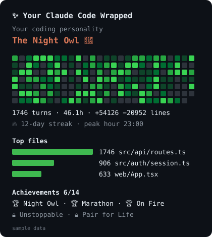

# code-wrapped

Your **Claude Code Wrapped**: run `/wrapped` for a pane with your year in code.



- **GitHub-style activity heatmap**: a pixel grid in the terminal, an SVG with hover tooltips in the desktop app.
- Turns, hours with Claude, lines added and removed, files touched, streak, busiest day, peak hour.
- **Top files** and **favourite tools** as bar charts.
- **Your coding personality**: The Night Owl 🦉, The Refactorer 🧹, The Shell Wizard 🧙, The Detective 🔎, The Builder 🏗️, The Daredevil 🔥 or The Steady Shipper 🚢.
- **14 achievements** that pop up as toasts the moment you earn them: Night Owl, Early Bird, Weekend Warrior, Marathon, Centurion, Big Bang, Marie Kondo, On Fire, Unstoppable, Shell Wizard, Polyglot…
- **Copy share text** puts a one-line summary on your clipboard for sharing.

## Install

Requires **Claude Code 2.1.293 or later**: mods are an early-access feature and gain events with each release. Check with `claude --version`; update with `claude update`.

```
/plugin marketplace add lakmadev/code-wrapped
/plugin install code-wrapped@code-wrapped
```

`/wrapped` shows as many weeks as fit (up to 26); `/wrapped 52` asks for a year. Stats start counting from install and stay on your machine (Claude Code's plugin store), kept for 400 days.

Part of [lakmadev/claude-mods](https://github.com/lakmadev/claude-mods), a pack of eleven Claude Code mods. MIT licensed.
